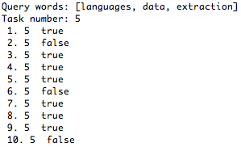
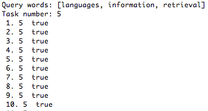
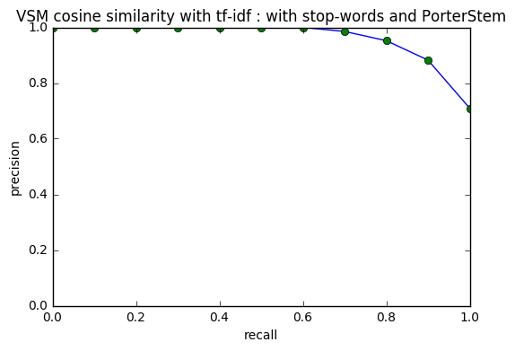

# Information-Retrieval
Index, search and rank

Data: A series of documents with title, text, topic number and relevance

Task: Building a search engine with Lucene

Evaluation: averaged 11-step precision recall curves 

Index documents with EnglishAnalyzer (include stop-words and PorterStemmer), make the same deal with query, then implement comparison with the Vector Space Model, TF-IDF and Cosine similarity. Return the results after rank.

For documents which have the topic "multiple language information retrieval", here gives two query results.

To evaluate the second query result, plot the averaged 11-step P-R curve.

